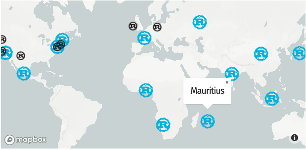
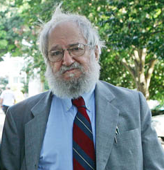
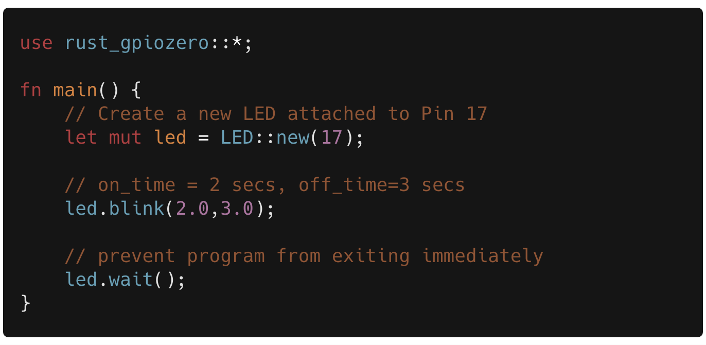
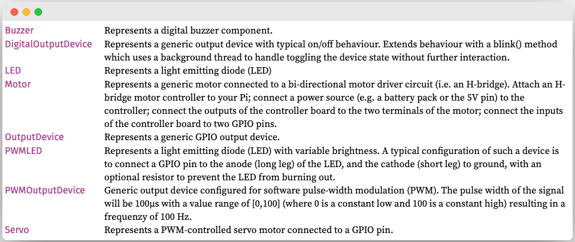
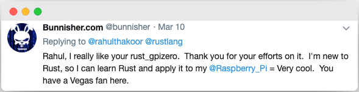
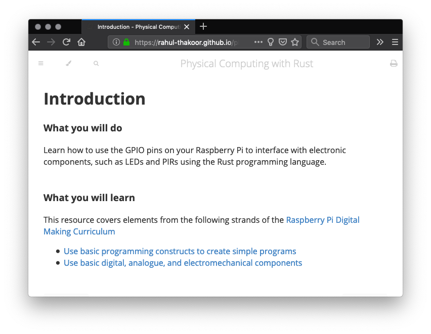
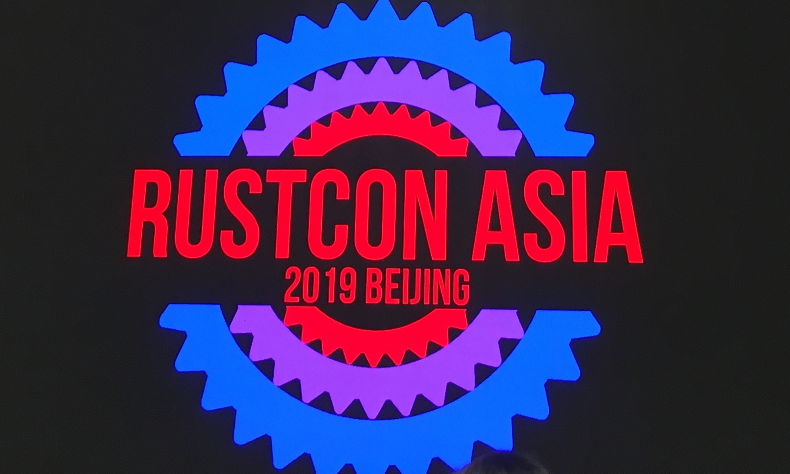
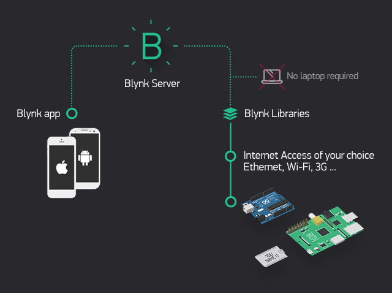
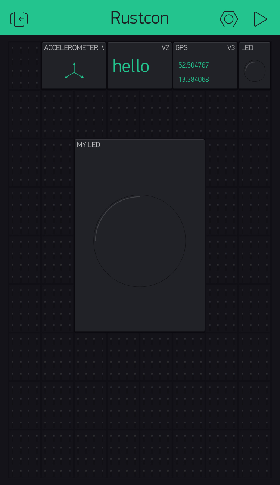

title: Bringing More People Closer To The Metal
class: animation-fade, dark-mode
layout: true

<!-- This slide will serve as the base layout for all your slides -->
<!-- .bottom-bar[
  {{title}}
] -->

---

class: impact, dark-mode-cog

# .small.oxide[{{title}}]

<!-- ### - Rahul Thakoor -->

---
class:middle
# Who am I?

## .big[👋 Hi! I'm Rahul]

--
-  🇲🇺 From Mauritius
--

- Increasing Rust's Reach 2018
--

- Creating **rust_gpiozero**
--

- Physical computing with Rust

---
class: center, middle

---
class: middle

> In more than a decade of teaching physical computing at New York University’s Tisch
School of the Arts, we have found people from very **diverse backgrounds** looking to bridge
this gap between the physical and the virtual. 
>
> <cite>~ .oxide[Physical Computing], Dan O'Sullivan and Tom Igoe</cite>

???
1. Teacher wishing to make more engaging classes with robotics/physical computing
2. Artist making interactive painting
3. Web developer doing some home automation

---

class: middle, center

.huge[The maker movement]

---
class: middle, center

>  **Maker culture** encourages novel applications of technologies, and the exploration of **intersections** between traditionally separate domains and ways of working including metal-working, calligraphy, film making, and computer programming. 
>
> ~ <cite>.oxide[Maker Culture], Wikipedia</cite>

---
class: impact, dark-mode-cog

# .oxide[My own journey]

--

.huge[# 👨🏽‍⚕️]

--

.huge[# 👨🏽‍💻]

???
1. MOOCs -> failed
2. Arduino
3. Lack of tutorials -> assumed prior knowledge

---
class: impact, dark-mode-cog
# .oxide.small[Why Should You Care?]

???
1. The Rust slogan has changed a lot throughout the years to now mainly highlight empowerment
---
class: middle,center

>  **Empowering everyone*** to build reliable and efficient software.
>
> ~ <cite>.oxide[The Rust Programming Language]</cite>

???
1. Empower: make (someone) stronger and more confident

---
class: middle, center

>  The Rust programming language is fundamentally about **empowerment**: no matter what kind of code you are writing now, Rust empowers you to **reach farther**, to program with confidence in **a wider variety of domains** than you did before.
>
> ~ <cite>.oxide[The Rust Programming Language Book]</cite>

???
1. Eliminate barriers
2. Flexibility: low level control or expressive high level features
3. Use skills to write drivers, OS, webapps
4. Rust runs on microcontrollers such as m-cortex to serverless services such as cloud lambda functions 

---
class: impact, dark-mode-cog
# .oxide.small[Barriers to entry]

---
class: center, middle

## ⚡️ Basic Electronics & Circuits
--

## 💻 Computers and Microcontrollers
--

## 👨🏻‍💻 Programming
--

## 📡 Communication and protocols

???
1. jargon
2. assumed prior knowledge
3. inaccessibility to devices
---

class: impact, dark-mode-cog
# .oxide[Why physical computing?]
---

class: middle, center

.huge[Computers as learning instruments]

???
1. Why physical computing
2. manipulation of abstract information
3. write code that is able to affect the real physical world is more engaging

---
class: middle,center

> The computer is the Proteus of machines. Its essence is its universality, its **power to simulate**. Because it can take on a **thousand forms** and can serve a **thousand functions**, it can appeal to a **thousand tastes**.
>
> <cite>~ .oxide[Mindstorms], Seymour Papert</cite>

--

.citetext[source: Rodrigo Mesquita, Wikimedia.org]

???
1. Proteus: a sea god, son of Oceanus and Tethys, noted for his ability to assume different forms and to prophesy
1. Artificial Intelligence
2. Constructionism - learners construct mental models to understand the world around them
3. Logo programming language
4. 

---
class: impact, dark-mode-cog
# .oxide[How?]

---
class: center, middle
# Abstraction

???

1. Abstraction is a technique for hiding complexity that is irrelevant to
the problem in context
2. Machine language -> Assembly -> Programming language
3. Recurring patterns
---
class: center, middle
# High Level Libraries

???

---
class: impact,dark-mode-cog

.huge[## `rust_gpiozero` 📦]
---
class: center,middle

---
class: center,middle

---
class: middle,center

---

class: center, middle
# Top-Down Approach

---

class:middle,center

# Standing on the shoulders of giants

--

## `rppal`
---

class: middle,center

## embedded-hal
## PWM
## SPI
## I2C

---

class: impact, dark-mode-cog
# .oxide.small[Guides, Tutorials and Documentation]

???
1. Libraries are not enough
2. Drawing the owl
3. 

---
class: center,middle

.citetext[https://www.flickr.com/photos/centralasian/5229725173]
---

class: middle,center

---

class: impact, dark-mode-cog
# .oxide.small[Teaching & Learning]

---

class: center,middle

# Workshops and Bootcamps

???
1. Just enough to get by
2. Buying gears is a huge commitment
3. Simply not available
4. 
---

class: center,middle

<!-- # RustCon Asia 2019 : Beijing -->

---
class: center, middle

???
1. using laptop/smartphone as iot devices
2. tap into existing sensors
3. 
---
class: center, middle

 
---

class: impact, dark-mode-cog
# .oxide.small[Your Turn]

---
class: impact, dark-mode-cog

# .oxide[Thanks 🙏🏻]

### Questions?

---
# Acknowledgement

- Theme inspired by [rocket.rs](https://rocket.rs/)
- Floating Cogs by [Hero Patterns](https://www.heropatterns.com/)

